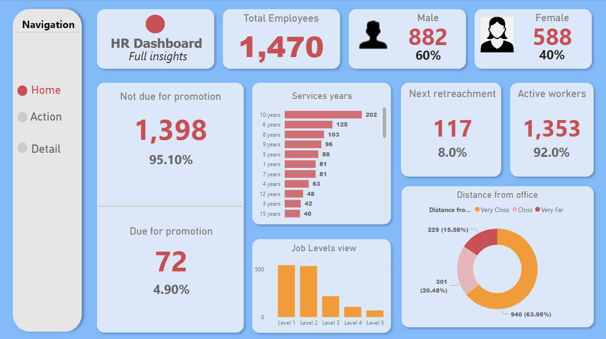
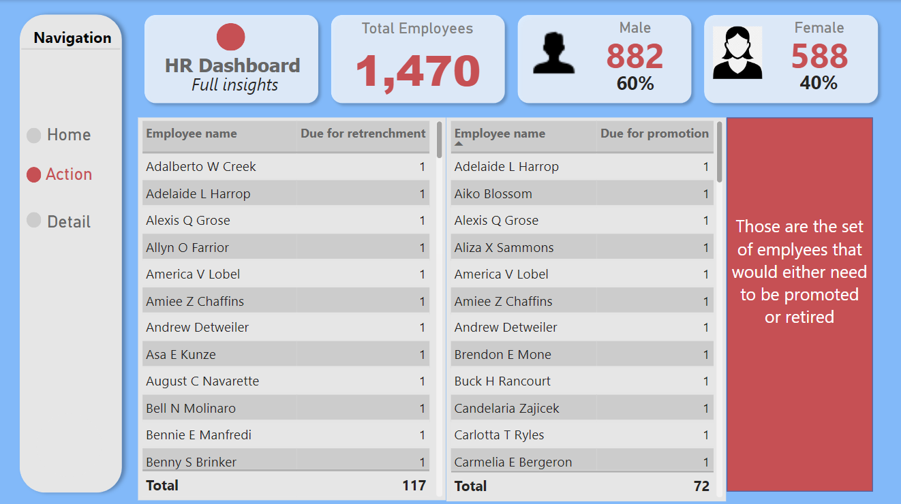
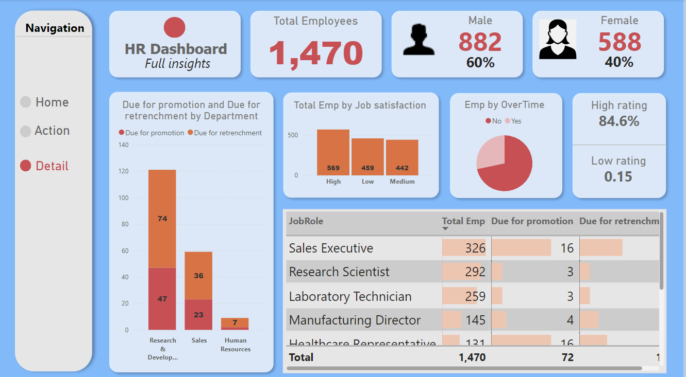

# HR Dashboard

## Overview
This repository contains a Power BI HR Dashboard designed to help HR departments monitor and manage key metrics related to employee performance, diversity, turnover, and other important HR functions. The dashboard provides interactive visuals and data insights to support data-driven decision making.

## Features
- **Employee Performance**: Track and analyze individual and team performance metrics.
- **Diversity and Inclusion**: Monitor diversity statistics to ensure a balanced and inclusive workplace.
- **Turnover Rates**: Evaluate employee turnover rates and identify patterns or areas of concern.
- **Hiring Metrics**: Analyze recruitment efficiency, including time-to-hire and source of hire.
- **Attendance and Leave**: Monitor attendance trends and leave balances.

## Dashboard Screenshots
Here are some screenshots of the HR Dashboard:

### 1. Home Page


### 2. Action page


### 3. Detail page


## How to Use
1. **Clone the repository**: 
   ```bash
   git clone https://github.com/yourusername/hr-dashboard.git
   ```
2. **Open in Power BI**:
   - Ensure you have [Power BI Desktop](https://powerbi.microsoft.com/desktop/) installed.
   - Open the `.pbix` file in Power BI Desktop.

3. **Connect to Data Source**:
   - Update the data source settings to point to your HR data.

4. **Customize**:
   - Modify the visuals and metrics as needed to suit your organization's requirements.

## Contributions
Contributions are welcome! If you have any improvements or new features to add, please submit a pull request.

## License
This project is licensed under the MIT License. See the [LICENSE](LICENSE) file for details.

## Contact
For any questions or feedback, please contact [yourname@example.com](mailto:gowdavidwan2003@gmail.com).
